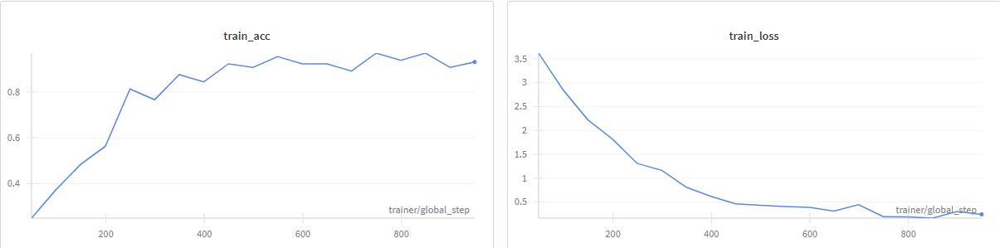
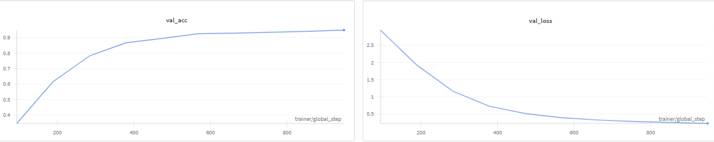
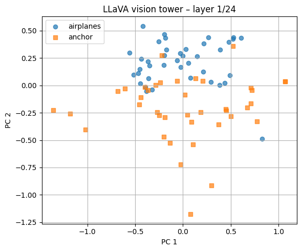
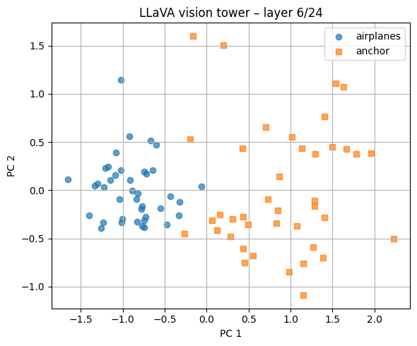
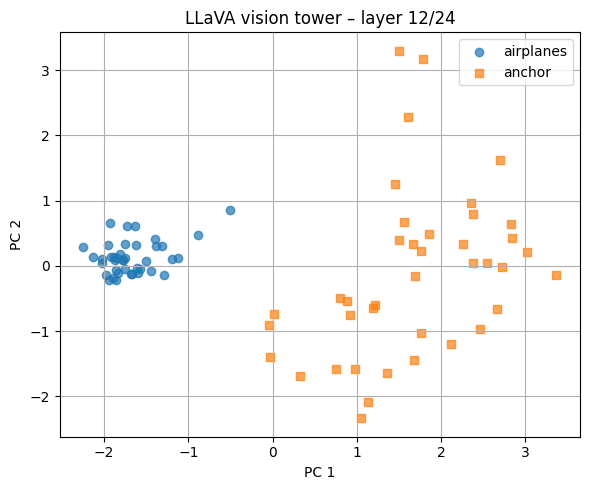
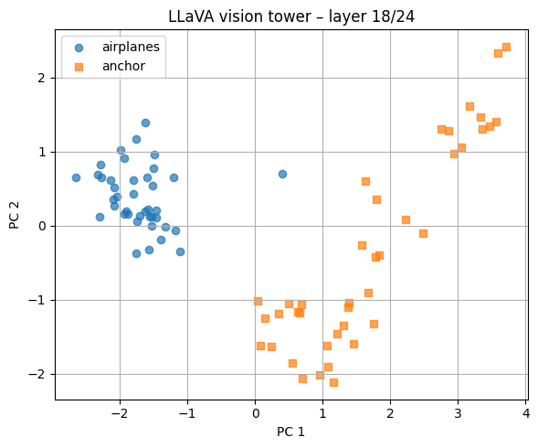
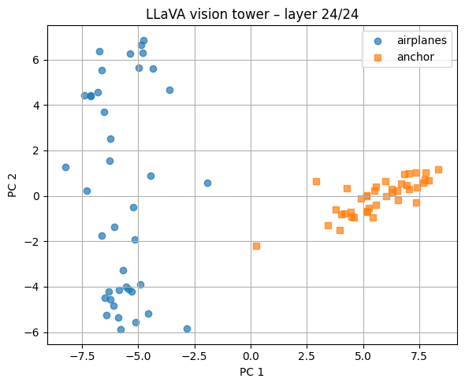

# surf-task
Author: Anna Rutkiewicz

## Results of the classification task

### CLIP

The CLIP embeddings + lightweight neural network approach performed really well on the classification task. For a training over 10 epochs, it achieved the following results:

| Split | Accuracy | Loss |
| :---- | :--- | :--- |
| TRAIN | `0.9298` | `0.2423` |
| VAL | `0.9493` | `0.2238` |
| TEST | `0.9275` | `0.2518` |

From the plots, it can be observed that the training runs as expected. The train accuracy and loss are a bit bumpy, however - perhaps

### LLAVA
The LLAVA zero shot classifier approach performed significantly worse. Initial TEST accuracy, without code tweaking, was as low as `0.0483`. To improve the results, I made the following changes:
- introducing the `_pretty_name` function to transform raw labels read from the dataset into more human-friendly (and LLM-friendly) format,
- prompting the model to output the numerical label id, instead of the label name,
- specifying the model's answer as the last found number in the model's generated output (instead of the first one).

Thanks to those changes, I managed to increase the TEST accuracy up to `0.2808`, which is a significant improvement.

### Comparison of the results
Overall, the CLIP setup works very well, which is what one would expect from the strong visual encoder + small classifier trained on the embeddings. The small classifier quickly learns a clean decision boundary for the CLIP's embeddings space.

On the other hand, LLAVA zero-shot classifier performs poorly. Out of the box it performs slightly better than a chance level (~4% instead of ~1% - as we have 101 classes), which is a poor performance. That might stem from the fact that LLAVA is a multimodal chat model and not a classifier, so it freely generates language, might paraphrase labels etc. The prompt engineering and tweaking helps to force it into producing a more standardized output, pushing the accuracy up to 28%. That is a clear demonstration of:
- the impact of prompt engineering on the LLMs results
- the fact that VLMs on their own, without additional tweaks, remain fundamentally less effective in classification tasks, than classifiers trained on the dataset - especially for many-class recognition cases.

## Results of the Bonus task

### Before dimensionality reduction, what are the original dimensions of your embeddings?
Before the dimensionality reduction, each image is represented by the CLS embedding from the LLaVA vision tower, which has 1024 features. Since I decided on a 2-class subset, 40 images per each class, this results in a matrix of size 80x1024.

### At what sequence index/indices did you acquire LLaVA embeddings, and why? 
Every hidden state tensor has shape `(batch_size, seq_len, num_feat) = (batch_size, 577, 1024)`. In the `seq_len` position, index 0 corresponds to the CLS token, and the rest are patch tokens. I decided to acquire the sequence index corresponding to the CLS token, as it aggregates information from all patches and can be thought of as an image representation. An alternative approach would be mean-pooling over patch tokens, but I decided that CLS token might be a neater solution.

### What is the difference between different layers?
I acquired LLaVA embeddings at layers 1, 6, 12, 18, and 24. I decided for this equally-spaced choice, as I wanted to track how the embeddings change as they go through more and more layers. 

As can be seen, for layer 1, `airplanes` and `anchor` embeddings are quite heavily overlapping. As we move on deeper with the layers, the plots show a clear progression from an unorganised mix into easily separable clusters. This aligns well with the assumption that early layers capture mostly low-level visual features (such as edges, colours etc.) - and higher layers capture more abstract, class-specific representations.

### Note on PCA vs classification results
It is also worth noting that, even though the final layer's embeddings are quite easily separable into two groups, which would suggest it is easy to classify them - LLaVA still performs poorly on the classification task. Perhaps it is caused by the fact that the decision boundary gets more messy for two classes that are more similar to each other than the selected `airplanes` and `anchor` - or by the fact that mapping the visual features to the correct label via prompting is the true bottleneck of this task.
